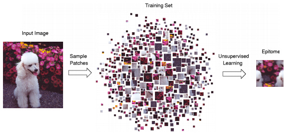
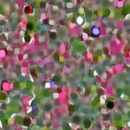

# Epitome

Forked from [Epitome Transform Coding: Towards Joint Compression of a Set of Images](https://github.com/ccj5351/epitome_coding).

Adding my learnings and thoughts with a working build command, improved code structure, readibility, compatbility, etc.

## The Approach
<p align="center">


</p>

- Learning the epitome `E` of a collection of images `{I_i}`, and doing the reconstruction via `E` and the associated transform map `{Φ_i}`.

- Then the bitstream of entropy-encoded epitome, transform maps, and residuals, can be transmitted with bandwidth saving and economic storage.

- Last, the transmitted bitstream will be decoded for the final rendering.

## Epitome Learning and Reconstruction

### What is the Epitome?

See papers:
> [Epitomic analysis of appearance and shape](https://ieeexplore.ieee.org/document/1238311)

> [Learning the “Epitome” of an Image](https://www.semanticscholar.org/paper/Learning-the-%22Epitome%22-of-an-Image-Frey-Jojic/24892dd2e8ebaede2de24fe04531257b52a908c1)

- An epitome is a condensed image of parameters that specifies a generative model of patches taken from
input images. 

- It contains high-order statistics of the texture and shape properties of the input images.

- A epitome in size `W x H` can be viewed as a mixture of `W*H` Gaussians.

### Epitome Learning

- The epitome is learned so that when small patches are sampled in an unordered fashion from it, they will have nearly the same appearance as patches sampled from the original input image.
<p align="center">
  
</p>

- Here we show the input, the learned epitome, and the reconstructed output:
<p align="center">
  
  
  
</p>

## Getting Started
### Build
Clone the repo. To build `epitome_fft.exe`, run the following commands:
```
cmake .
make -j
```

### Config
Check out the configuration file `default.cfg`, which contains a number of parameters for customization:

`DatabaseDir`: Aboslute path to the input folder for images data.

`EpitomeResultDir`: Aboslute path to the output folder for epitome results.

`ReconsCompresDir`: Aboslute path to the output folder for reconstructed results.

`newPatchSpacingNum`: Different values of newPatchSpacing, e.g., recon-4, recon-8.

`newPatchSpacing`: Patch spacing.

`fileNameforRowCol_Idx_YML`: Suffix for the `.yml` file name.

`save_img_num`: Maximum number of images saved as the final result.

`nthreads`: Thread numbers used for parallel execution;

`max_omp_for_idx`: Maximum size of a parallel loop due to memory limit.

`epitomeWidth`: Width of the epitome.

`epitomeHeight`: Height of the epitome. Should be the exact same as `epitomeWidth`.

`patchSideLength`: Patch slide length.

`patchSpacing`: Patch spacing size.

`numIteration`: Number of EM iterations.

`nameDifference`: Suffix for the reconstructed files, e.g. "recon_".

`imgEpi_EncodeType`: File extension for the reconstructed files, e.g. ".jpg", ".bmp", or ".png".

`Epi_overheadKind_Num`: Epitome data file size, in bytes


### Execute
To execute the epitome_fft.exe, be mindful of the input parameters:

```
./epitome_fft.exe [configuration file] [verbose flag] [grayscale flag] [random shifting flag] [image category] [execution mode]
```

`configuration file`: The `.cfg` file that contains configurations for this run.

`verbose`: Verbose logging switch.

`grayscale`: Grayscale picture switch.

`random shifting`: Allow random shifts from the regular patch positions.

`image category`: A descriptive name pointing to a sub-directory under images folder.

`execution mode`: 1 means only learn epitome; 2 means learn and reconstruction; 3 means processing of row-column indices and direct images reconstruction.